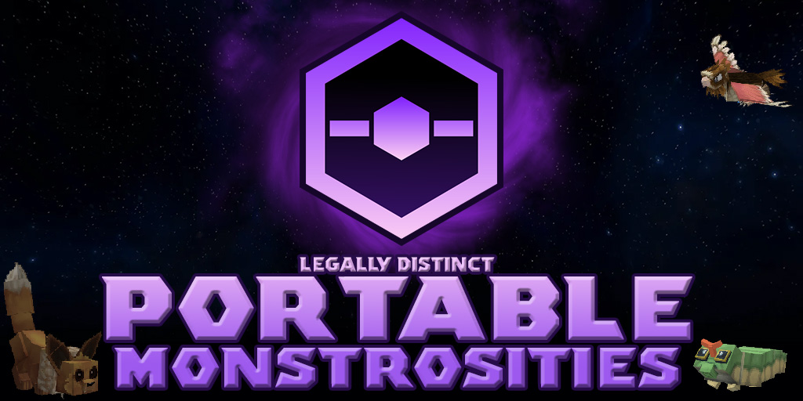

[View on CurseForge](https://www.curseforge.com/hytale/mods/portable-monstrosities)

## ** WIP **

- Throwable capture item which has a chance to tame an NPC it hits, make sure to weaken them first to increase your chances.
- NPCs spawn with random level (range set via NPCRole json), levelling currently affects HP only 
- Some NPCs can evolve if they've reached the required level
- Added several new elemental damage types:
    - Poison
    - Psychic
    - Rock
    - Steel
    - Water
    - Bug
    - Dark
    - Dragon
    - Electric
    - Fighting
    - Fire
    - Flying
    - Ghost
    - Grass
    - Ground
    - Ice
    - Normal
- NPCs have slots for two elemental types, which give them resistances and weaknesses to attacks
- NPCs have slots for four attack, set in NPCRole json

NPCs added (incomplete)

  
This is just whatever generated icons I already had, some are missing and some are old

  

----

- They need to work on their timing
- Currently just spawn randomly, no bases yet
- Will shoot NPCs on sight, which doesnt always end well for them

----

- PC storage for captured NPCs
- For now a single crafting bench crafts almost all mod items, likely to change
- Foundry bench for mixing alloys

----

- Currently all entrances lead to the same secret base instance

----

- Berries
- Round fruit for crafting throwable capture items
- Disc weapons that allow you to use NPC abilities
- Earthquake
- Bubble
- Surf
- Flash
- Thundershock
- Razor Leaf
- Rock Throw
- A grappling hook (Vine whip)
- Evolution stones
- Potions
- Experience candy
- Hides + leathers
- Ores + ingots
- Pizza

----

WORLDGEN V2

TODO: add some pictures of new biomes + structures
